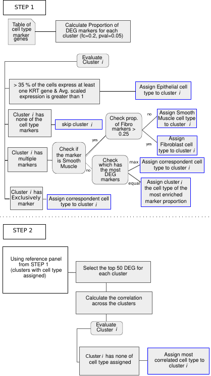

# SuperCAT
SUPERvised single Cell Annotation Tool

## Introduction
This document contains code workflows, explaining how to perform the bioinformatics analysis described in ***A single-cell sequencing analysis of endometriosis, endometriomas, eutopic endometrial samples and uninvolved ovary tissues highlights cell populations characteristic of these tissue types. Significant transcriptional and cellular heterogeneity across tissues suggests their reprogramming is crucial in this disease***

### Authors

Marcos A.S. Fonseca\*, Marcela Haro\*, Kelly N. Wright\*, Xianzhi Lin\*, Forough Abbasi, Jennifer Sun, Lourdes Hernandez, Natasha L. Orr, Jooyoon Hong, Yunhee Choi-Kuaea, Horacio M. Maluf, Bonnie L. Balzer, Aaron Fishburn, Ryan Hickey, Ilana Cass, Helen S. Goodridge, Mireille Truong, Yemin Wang, Margareta D. Pisarska, Huy Dinh, Amal EL-Naggar, David Huntsman, Michael S. Anglesio, Marc T. Goodman, Fabiola Medeiros†, Matthew Siedhoff†, Kate Lawrenson†

Please visite the following page for the workflow tutorial description
https://lawrenson-lab.github.io/SuperCAT
